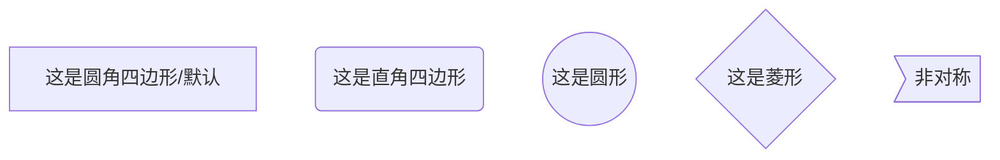
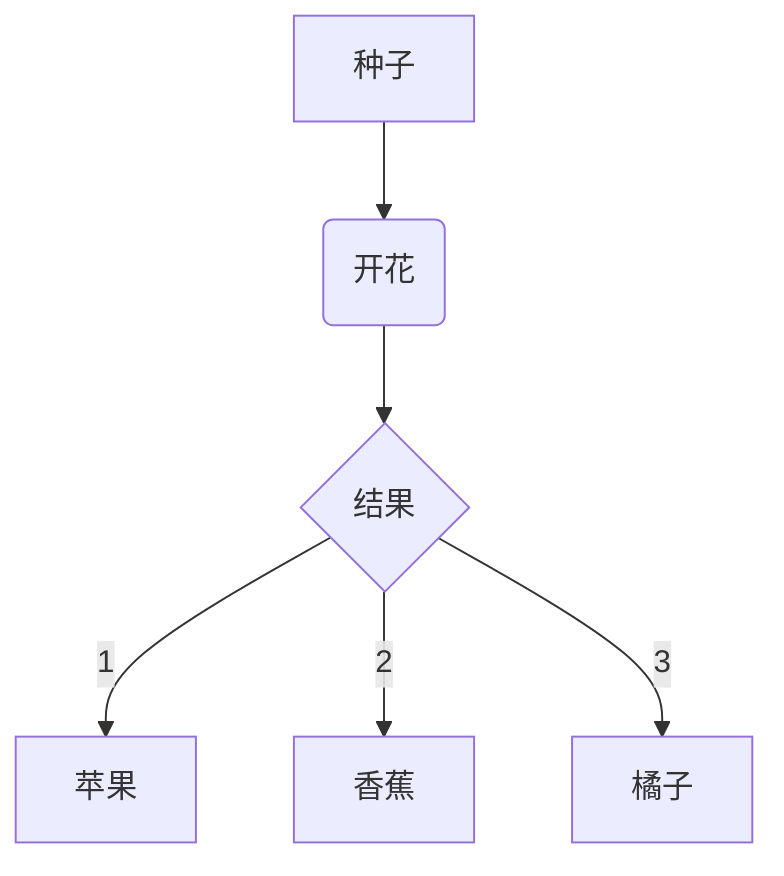
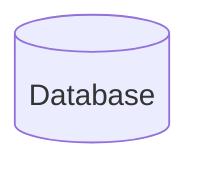

# 使用Flow
- 编辑器中可预览，但Github中无法直接查看。故，不采用。

```mermaid
graph TB
A[Apple]-->B{Boy}
A---C(Cat)
B.->D((Dog))
C==喵==>D
style A fill:#2ff,fill-opacity:0.1,stroke:#faa,stroke-width:4px
style D stroke:#000,stroke-width:8px;

```

```mermaid 竖向和横向
graph TB
A --> B
graph BT
A --> B
graph RL
A --> B
graph LR
A --> B
```



```mermaid 对箭头的调整
graph TB 
A1 --> B1
A2---B2
A3---|text|B3
A4-->|text|B4
A5.-B5 
A5-.-B5 
A5..-B5
A6.->B6 
A6-.->B6 
A6..->B5
A7-.text.-B7
A8-.text.->B8
A9===B9
A10==>B10
A11==text===B11  
A11===|test|B11
A12==text==>B12 
A12 ==>|Text| B12
```





```md
#开始 start
st=>start: 开始

#结束 end
e=>end: 结束

#普通操作块 opration
op1=>opration: 第一个操作块
op2=>opration: 第二个操作块

#判断块 condition
cond1=>condition: 第一个判断
cond2=>condition: 第二个判断

#输入输出块 inputoutput
io1=>inputoutput: 输入输出块 1
io2=>inputoutput: 输入输出块 2

#子任务块
sub1=>subroutine: 子任务 1
sub2=>subroutine: 子任务 2

#判断流程控制
cond1(yes)->op1 #yes 的时候回到 op1
cond1(no)->e #no 的时候 去结束 #位置指定
cond1(no)->op2(right)->op1 #控制 op2 位置置于右边，再由 op2 返回 op1 (好像不能向左) #还可以这样 cond1(no,right)
cond1(yes)->e

st->op1->e

# -> 作为控制流程的操作符，就是指向下一步要操作的。

# 每一条都算是一条流程

# 你也可以断开写，怎么方便怎么来，如：下面两个是一样的。

#分着写
st->op1
op1->e

#合着写
st->op1->e

#判断也是一样：
st->cond
cond(yes)->io
cond(no)->op1
```

```flow
st=>start: 开始
e=>end: 结束
op=>operation: 我的操作
cond=>condition: 确认？

st->op->cond
cond(yes)->e
cond(no)->op
```

```flow
st=>start: 开始
op1=>operation: 第一个矩形|past
op2=>operation: get_proxy|current
sub1=>subroutine: get_proxy|current
op3=>operation: save_comment|current
op4=>operation: set_sentiment|current
op5=>operation: set_record|current

cond1=>condition: 第一个方片
cond2=>condition: proxy_list空?
cond3=>condition: ids_got空?
cond4=>condition: 爬取成功??
cond5=>condition: ids_remain空?

io1=>inputoutput: 第一个矩形旁边的IO矩形
io2=>inputoutput: proxy_list
io3=>inputoutput: ids-got
e=>end: 结束:>https://github.com/Lokavit


st->op1(right)->io1->cond1
cond1(yes)->sub1->io2->cond2
cond2(no)->op3
cond2(yes)->sub1
cond1(no)->op3->cond4
cond4(yes)->io3->cond3
cond4(no)->io1
cond3(no)->op4
cond3(yes, right)->cond5
cond5(yes)->op5
cond5(no)->cond3
op5->e

```

```flow
st=>start: index
op=>operation: 申请
op2=>operation: 结果页
op3=>operation: 查询本地
i1=>inputoutput: bid入库
i2=>inputoutput: 填写个人信息
c1=>condition: 检查登录
c2=>condition: 登录
c3=>condition: 查询本地记录
c4=>condition: 检测状态
c5=>operation: 风控审核
e=>end

st->op->c1()
c1(no)->c2(yes)->op()
c1(yes)->c3(no)->i1(right)->i2(right)->c5()->op2->e
c1(yes)->c3(yes)->c4(no)->i2
c1(yes)->c3(yes)->c4(yes)->op3->op2
c3()->e
```
